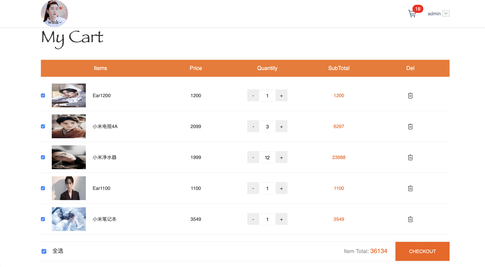
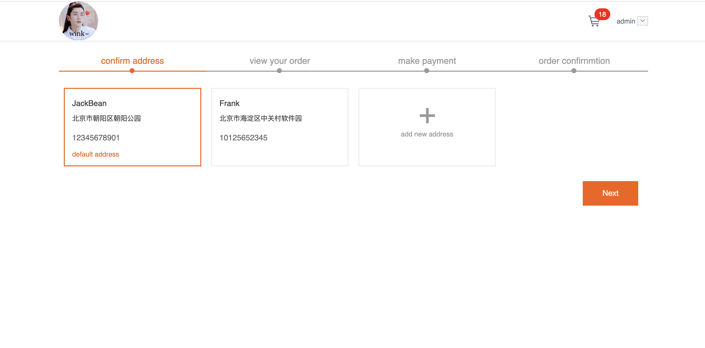

Get全栈技能点 *Vue2.0* / *Node.js* / *MongoDB* 打造商城系统 **更进版本**


### 前言

这个是学习慕课网实战课程 Get全栈技能点 *Vue2.0* / *Node.js* / *MongoDB* 打造商城系统改造完成，整个项目包含6个页面，涉及商品列表、购物车、收获地址、订单确认、完成等功能，后续会持续完善新增。

重新实现一遍主要是为了练习和熟悉自己对vue全家桶配合 NodeJs+MongoDB的使用。

欢迎各路大神Issues


### 技术栈

```
前端：Vue2.x + vue-router + vuex  + axios + webpack

后台：Node.js+Express
通过Node.js进行实现，通过Express框架实现后端的REST接口，并以json的形式进行输出

数据存储：MongoDB
以最常用的数据传输格式json进行数据存储，并且可以和Node.js进行无缝集成
```


### 项目运行

```
# install dependencies
npm install

# serve with hot reload at localhost:8080
npm run dev

# build for production with minification
npm run build

# build for production and view the bundle analyzer report
npm run build --report
```


### 说明

> 本项目主要用于练习掌握

> 如有问题请直接在Issues中提出

> 如果觉得对您学习vue有点点帮助，请右上角star一下吧 ^_^


### 功能列表

- [x] 登陆拦截、登出

- [x] 注册

- [x] 商品列表

- [x] 价格筛选、排序

- [x] 加入购物车

- [x] 购物车

- [x] 收获地址

- [x] 订单确认
- [ ] 新增地址
- [ ] 编辑地址
- [ ] 代码优化

…… 


### 页面部分截图








### 项目布局

```
.
├── README.md
├── build
│   ├── build.js
│   ├── check-versions.js
│   ├── logo.png
│   ├── utils.js
│   ├── vue-loader.conf.js
│   ├── webpack.base.conf.js
│   ├── webpack.dev.conf.js
│   └── webpack.prod.conf.js
├── config
│   ├── dev.env.js
│   ├── index.js
│   └── prod.env.js
├── index.html
├── package-lock.json
├── package.json
├── server
│   ├── app.js
│   ├── bin
│   │   └── www
│   ├── modules
│   │   ├── goods.js
│   │   └── users.js
│   ├── package.json
│   ├── public
│   │   ├── images
│   │   │   └── logo.jpg
│   │   └── stylesheets
│   │       └── style.css
│   ├── routes
│   │   ├── goods.js
│   │   └── users.js
│   └── views
│       └── index.html
├── src
│   ├── App.vue
│   ├── assets
│   │   ├── css
│   │   │   ├── common.scss
│   │   │   └── reset.scss
│   │   ├── iconfont
│   │   │   ├── iconfont.css
│   │   │   ├── iconfont.eot
│   │   │   ├── iconfont.js
│   │   │   ├── iconfont.svg
│   │   │   ├── iconfont.ttf
│   │   │   ├── iconfont.woff
│   │   │   └── iconfont.woff2
│   │   └── image
│   │       └── logo.jpg
│   ├── components
│   │   ├── breadCrumb.vue
│   │   ├── dialog
│   │   │   ├── index.js
│   │   │   └── toast.vue
│   │   ├── goodCard.vue
│   │   ├── navBar.vue
│   │   └── toast
│   │       ├── index.js
│   │       └── toast.vue
│   ├── main.js
│   ├── page
│   │   ├── addressList.vue
│   │   ├── goodList.vue
│   │   ├── orderSuccess.vue
│   │   ├── shoppingCart.vue
│   │   └── viewOrder.vue
│   ├── router
│   │   └── index.js
│   ├── store
│   │   ├── action.js
│   │   ├── getters.js
│   │   ├── index.js
│   │   ├── mutation-types.js
│   │   ├── mutations.js
│   │   └── state.js
│   └── utils
│       └── axios.js
├── static
│   ├── image
│   │   ├── 1.jpg
│   │   ├── 10.jpg
│   │   ├── 11.jpg
│   │   ├── 2.jpg
│   │   ├── 3.jpg
│   │   ├── 4.jpg
│   │   ├── 5.jpg
│   │   ├── 6.jpg
│   │   ├── 7.jpg
│   │   ├── 8.jpg
│   │   ├── 9.jpg
│   │   └── logo.jpg
│   └── loading
│       └── loading-bars.svg
└── tree.text

25 directories, 90 files
```


